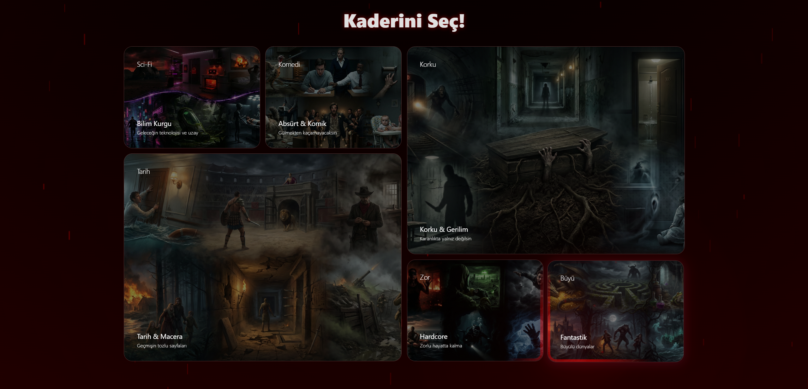
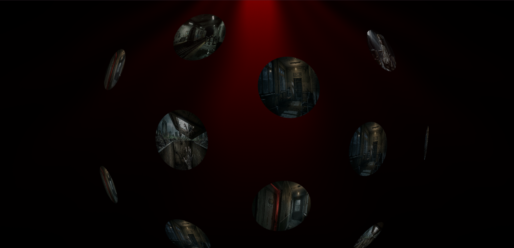
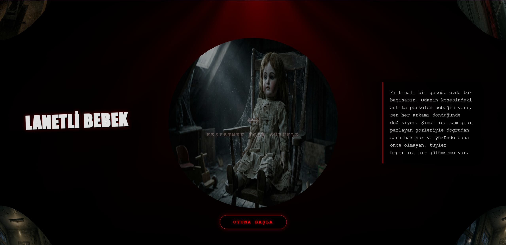
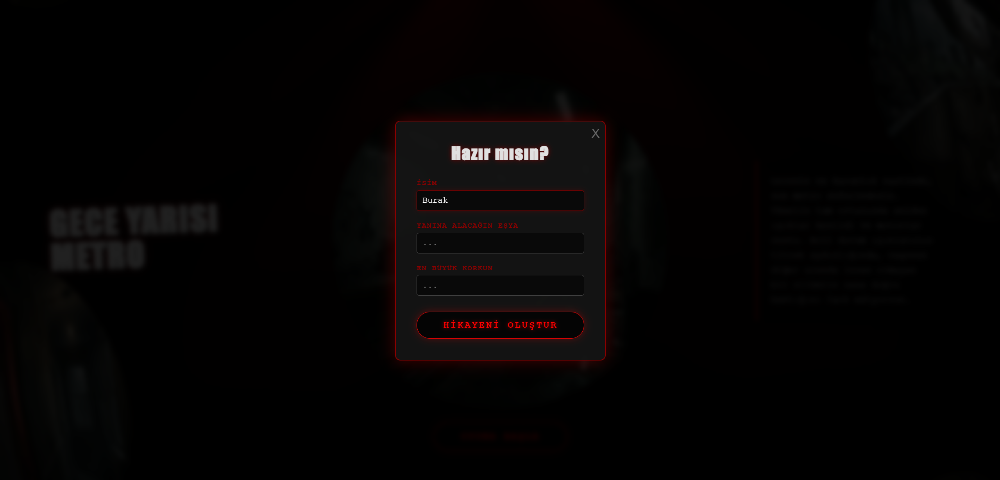
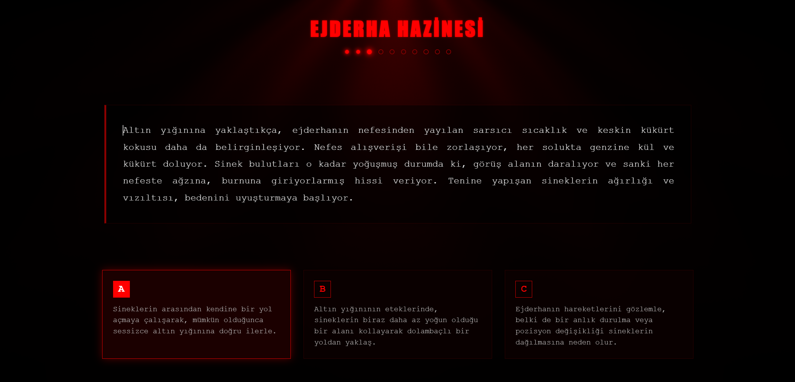
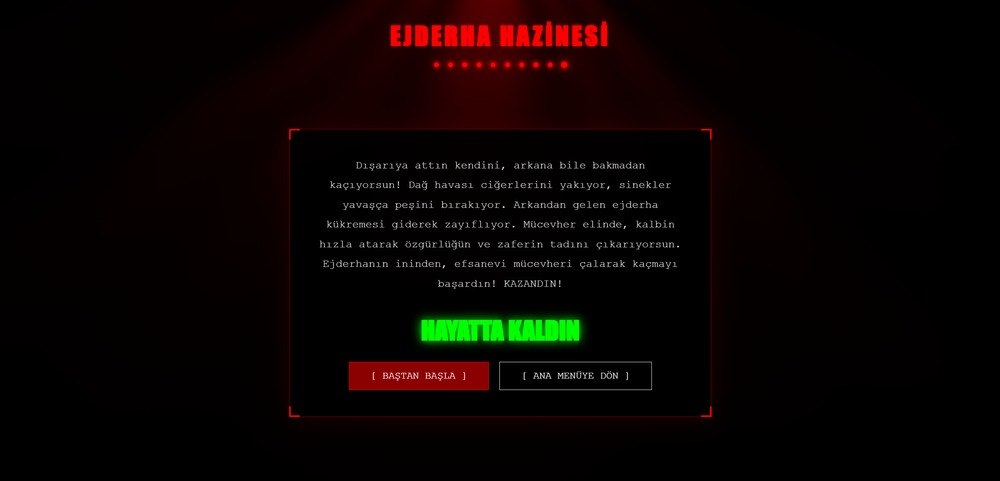

# 🏃‍♂️ RUN — AI Powered Text Adventure Game

<p align="center">
  <a href="https://burakyucelpy.github.io/RUN/">
    
  </a>
  <a href="https://react.dev/">
    
  </a>
  <a href="https://fastapi.tiangolo.com/">
    
  </a>
  <a href="https://deepmind.google/technologies/gemini/">
    
  </a>
</p>

> **RUN**, Google Gemini AI altyapısını kullanarak her oynanışta benzersiz, sürükleyici ve interaktif hikayeler oluşturan yeni nesil bir metin tabanlı macera oyunudur.

## 📋 Proje Hakkında

**RUN**; klasik "Choose Your Own Adventure" (Kendi Maceranı Seç) kitaplarını modern yapay zeka teknolojisiyle birleştirir. Kullanıcının seçtiği kategori, girdiği isim, korkuları ve yanına aldığı eşyalar, yapay zeka tarafından işlenerek **kişiye özel** bir hayatta kalma senaryosuna dönüştürülür.

- **Frontend**: React + React Router DOM + Three.js
- **Backend**: FastAPI + Python
- **AI Modeli**: Google Gemini 2.5 Flash
- **Özellikler**: 
  - Dinamik hikaye üretimi
  - 3D interaktif menüler
  - Kişiselleştirilmiş korku ve eşya entegrasyonu

## 🌐 Canlı Demo

Projeyi tarayıcıdan hemen deneyin: **[https://burakyucelpy.github.io/RUN/](https://burakyucelpy.github.io/RUN/)**

## 🖼️ Ekran Görüntüleri

### 1. Başlangıç ve Atmosfer
Karanlık ve gizemli bir atmosfer ile oyuncuyu karşılayan giriş ekranı.

<p align="center">
  <br/>
  <em>Giriş Ekranı</em>
</p>

### 2. Kaderini Seç
Oyuncular Bilim Kurgu, Korku, Komedi, Tarih gibi farklı kategoriler arasından seçim yapar.

<p align="center">
  
  
  <br/>
  <em>Kategori Seçimi ve 3D Menü Efektleri</em>
</p>

### 3. Senaryo ve Karakter Detayları
Seçilen kategoriye özel senaryolar listelenir. Ardından oyuncu ismini, en büyük korkusunu ve yanına alacağı eşyayı girerek hikayeyi kişiselleştirir.

<p align="center">
  
  
  <br/>
  <em>Senaryo Seçimi ve Karakter Oluşturma</em>
</p>

### 4. Oyun Deneyimi
Yapay zeka hikayeyi anlatır, seçenekler sunar ve oyuncunun kararlarına göre sonucu belirler.

<p align="center">
  <br/>
  <em>Yapay Zeka Hikayeyi Oluştururken...</em>
</p>

<p align="center">
  <br/>
  <em>Oyun Arayüzü ve Seçim Ekranı</em>
</p>

### 5. Sonuç: Zafer veya Ölüm
Her kararın bir bedeli vardır. Hikaye, oyuncunun seçimlerine göre zaferle veya trajik bir sonla biter.

<p align="center">
  
  
  <br/>
  <em>Oyun Sonu Ekranları</em>
</p>

## 🛠️ Kullanılan Teknolojiler

### Frontend

| Teknoloji | Açıklama |
|-----------|----------|
| **React** | Modern kullanıcı arayüzü |
| **React Router** | Sayfa yönlendirme (HashRouter) |
| **Three.js** | 3D görsel efektler ve animasyonlar |
| **GSAP** | Gelişmiş animasyon kütüphanesi |
| **Tailwind CSS** | Stil ve tasarım |

### Backend

| Teknoloji | Açıklama |
|-----------|----------|
| **FastAPI** | Yüksek performanslı Python web framework |
| **Uvicorn** | ASGI sunucusu |
| **Google Gemini API** | Hikaye ve mantık motoru (Gemini 2.5 Flash) |
| **Pydantic** | Veri doğrulama ve modelleme |
| **python-dotenv** | Çevre değişkenleri yönetimi |

### Deployment

| Platform | Kullanım |
|----------|---------|
| **GitHub Pages** | Frontend hosting |
| **Render** | Backend hosting (Free tier) |

## 🚀 Kurulum (Local)

Projeyi kendi bilgisayarınızda çalıştırmak için aşağıdaki adımları izleyin.

### 1. Repoyu Klonlayın
```bash
git clone https://github.com/BurakYucelPY/RUN.git
cd RUN
```

### 2. Backend Kurulumu (Python)
```bash
# Sanal ortam oluşturma (Opsiyonel ama önerilir)
python -m venv venv
.\venv\Scripts\activate  # Windows için

# Gerekli paketleri yükleme
pip install -r requirements.txt

# .env dosyasını oluşturun ve API anahtarınızı ekleyin
# Dosya içeriği: GEMINI_API_KEY=AIzaSy...
```

Backend'i başlatın:
```bash
uvicorn main:app --reload
```
Backend `http://localhost:8000` adresinde çalışacaktır.

### 3. Frontend Kurulumu (React)
Yeni bir terminal açın ve frontend klasörüne gidin:
```bash
cd frontend
npm install
npm start
```
Tarayıcınızda `http://localhost:3000` adresine gidin.

## 📁 Proje Yapısı

```
RUN/
├─ main.py                      # FastAPI Backend giriş noktası
├─ ai_service.py                # Gemini AI entegrasyon servisi
├─ requirements.txt             # Python bağımlılıkları
├─ frontend/                    # React Frontend Klasörü
│  ├─ public/                   # Statik dosyalar
│  ├─ src/
│  │  ├─ components/            # UI Bileşenleri (MagicBento, Loader vb.)
│  │  ├─ pages/                 # Sayfalar (Home, Story, Categories vb.)
│  │  ├─ navigation/            # Router yapılandırması
│  │  └─ utils/                 # Yardımcı fonksiyonlar (assets.js)
│  └─ package.json
├─ readMeImage/                 # README görselleri
├─ test/                        # Test dosyaları
└─ README.md                    # Proje dokümantasyonu
```

## 💡 Nasıl Çalışır?

1.  **Veri Toplama:** Kullanıcıdan senaryo türü, isim, korku ve eşya bilgisi alınır.
2.  **Prompt Mühendisliği:** Bu veriler, özel olarak tasarlanmış bir "System Prompt" ile birleştirilir.
3.  **AI İşleme:** Backend, bu prompt'u Google Gemini API'ye gönderir.
4.  **JSON Yanıt:** Gemini, hikayeyi, seçenekleri ve oyun durumunu (devam/bitti) içeren yapılandırılmış bir JSON döndürür.
5.  **Render:** Frontend, gelen JSON verisini işleyerek oyuncuya görsel bir arayüzde sunar.

## 🎨 Özelleştirme

- **Yeni Kategoriler Ekleme**: \`frontend/src/pages/Categories.jsx\` dosyasındaki kategori listesine yeni türler ekleyebilirsiniz.
- **Görsel Değişiklik**: \`frontend/public/assets/\` klasörüne yeni görseller ekleyerek arka planları ve tema resimlerini değiştirebilirsiniz.
- **Hikaye Ayarları**: \`ai_service.py\` dosyasındaki \`SYSTEM_PROMPT\` içeriğini düzenleyerek yapay zekanın anlatım tarzını, zorluk seviyesini veya kurallarını değiştirebilirsiniz.

## 🐛 Sorun Giderme

| Sorun | Çözüm |
|-------|-------|
| **Sunucu Yanıt Vermiyor** | Backend (Render) ücretsiz planda olduğu için 15 dk hareketsizlikten sonra uyku moduna geçer. İlk açılışta 1-2 dakika beklemeniz gerekebilir. |
| **Hikaye Oluşturulamadı** | Google Gemini API kotanız dolmuş olabilir veya API anahtarınız \`.env\` dosyasında hatalı tanımlanmış olabilir. |
| **Beyaz Ekran / 404 Hatası** | Sayfayı yenilediğinizde hata alıyorsanız \`HashRouter\` kullanıldığından emin olun. GitHub Pages SPA yönlendirmelerini desteklemez. |
| **Resimler Yüklenmiyor** | \`public/assets\` klasör yolunun doğru olduğundan ve \`getAssetPath\` yardımcı fonksiyonunun kullanıldığından emin olun. |
| **CORS Hatası** | Localhost veya canlı domain adresinizin backend \`main.py\` dosyasındaki \`CORSMiddleware\` ayarlarında izinli olduğundan emin olun. |

## 🎯 Gelecek Hedefleri

- [ ] Sesli anlatım (Text-to-Speech) entegrasyonu.
- [ ] Kullanıcıların kendi senaryolarını oluşturup paylaşabilmesi.
- [ ] Skor tablosu ve başarımlar.
- [ ] Çok oyunculu (Co-op) mod denemeleri.
- [ ] Zorluk ayarı ve can barı.
---
<p align="center">
  Made with ❤️ by <a href="https://github.com/BurakYucelPY">Burak Yücel</a>
</p>
